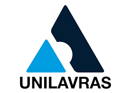

  

 
<h1 align="center"> 
	 Estrutura de Dados 
</h1>

 

<h2 align=left> 💡​ Info. sobre o Repositorio </h2>

 Atividades práticas da matéria de Estrutura de Dados, realizadas no 2º periodo do curso de   <strong>Análise e Desenvolvimento de Sistemas</strong> do <a href="https://unilavras.edu.br/"> <strong>Unilavras</strong></a>.

 

<h2 align=left> 🧰​ Tecnologias</h2>

  

 

  <h2 align=left> 📝​​ [LAB] Semana 1</h2>
  
  
Para visualizar o código basta clicar no <strong>Exercício</strong>.

  <ul>
  <li><a href="https://github.com/DaviF91/Unilavras.Estrutura-de-Dados/blob/master/%5BLAB%5D%20Semana%201/exerc1.py">Exercício 1</a></li>
  <li><a href="https://github.com/DaviF91/Unilavras.Estrutura-de-Dados/blob/master/%5BLAB%5D%20Semana%201/exerc2.py">Exercício 2</a></li>
  <li><a href="https://github.com/DaviF91/Unilavras.Estrutura-de-Dados/blob/master/%5BLAB%5D%20Semana%201/exerc3.py">Exercício 3</a></li>
  </ul>

 

  <h2 align=left> 📝​​ [LAB] Semana 2</h2>
  
  
Para visualizar o código basta clicar no <strong>Exercício</strong>.

  <ul>
  <li><a href="https://github.com/DaviF91/Unilavras.Estrutura-de-Dados/blob/master/%5BLAB%5D%20Semana%202/exerc1.py">Exercício 1</a></li>
  <li><a href="https://github.com/DaviF91/Unilavras.Estrutura-de-Dados/blob/master/%5BLAB%5D%20Semana%202/exerc2.py">Exercício 2</a></li>
  <li><a href="https://github.com/DaviF91/Unilavras.Estrutura-de-Dados/blob/master/%5BLAB%5D%20Semana%202/exerc3.py">Exercício 3</a></li>
  </ul>

 

  <h2 align=left> 📝​​ [LAB] Semana 3</h2>
  
  
Para visualizar o código basta clicar no <strong>Exercício</strong>.

  <ul>
  <li><a href="https://github.com/DaviF91/Unilavras.Estrutura-de-Dados/blob/master/%5BLAB%5D%20Semana%203/exerc1.py">Exercício 1</a></li>
  <li><a href="https://github.com/DaviF91/Unilavras.Estrutura-de-Dados/blob/master/%5BLAB%5D%20Semana%203/exerc2.py">Exercício 2</a></li>
  <li><a href="https://github.com/DaviF91/Unilavras.Estrutura-de-Dados/blob/master/%5BLAB%5D%20Semana%203/exerc3.py">Exercício 3</a></li>
  </ul>

 

  <h2 align=left> 📝​​ [LAB] Extra Semana 5</h2>
  
  
Para visualizar o código basta clicar no <strong>Exercício</strong>.

  <ul>
  <li><a href="https://github.com/DaviF91/Unilavras.Estrutura-de-Dados/blob/master/%5BLAB%5D%20Semana%205/Exerc1.py">Exercício 1</a></li>
  <li><a href="https://github.com/DaviF91/Unilavras.Estrutura-de-Dados/blob/master/%5BLAB%5D%20Semana%205/Exerc2.py">Exercício 2</a></li>
  <li><a href="https://github.com/DaviF91/Unilavras.Estrutura-de-Dados/blob/master/%5BLAB%5D%20Semana%205/Exerc3.py">Exercício 3</a></li>
  </ul>

 

<h2>​📧​​ Contato </h2>

  
  
   
 

